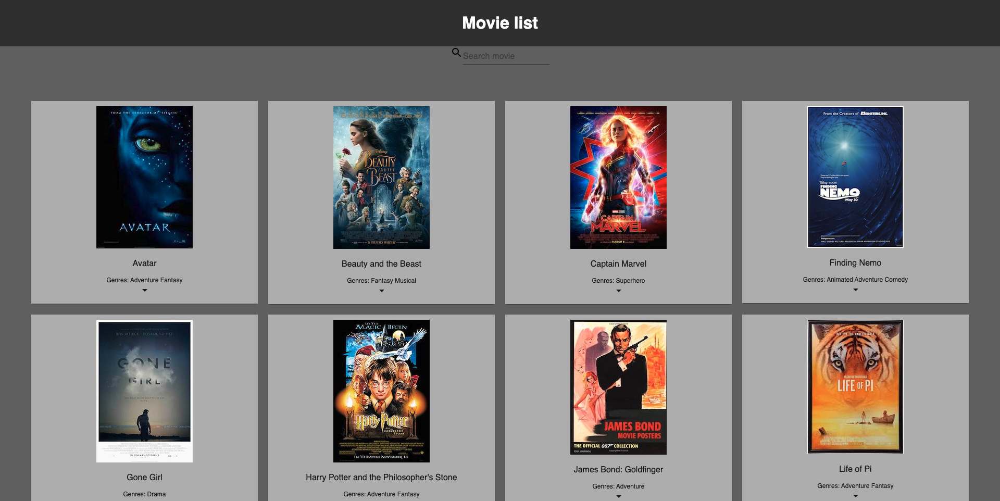
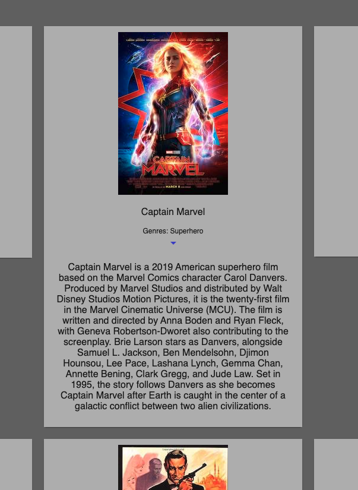
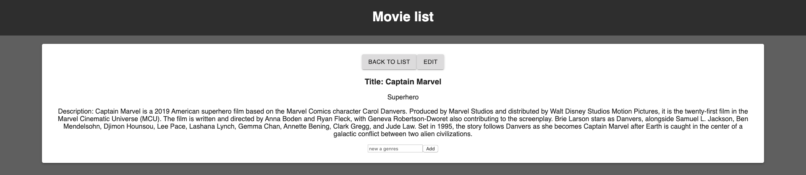
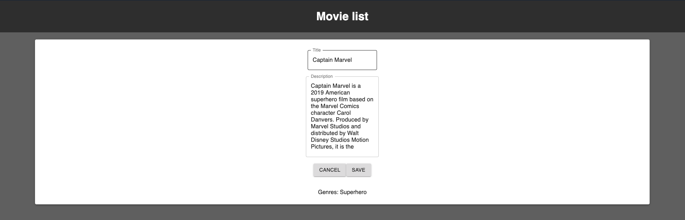
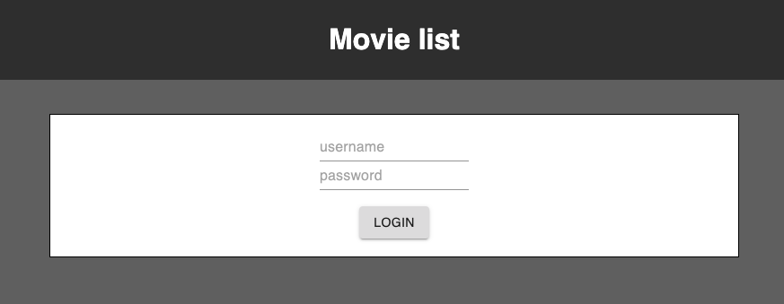
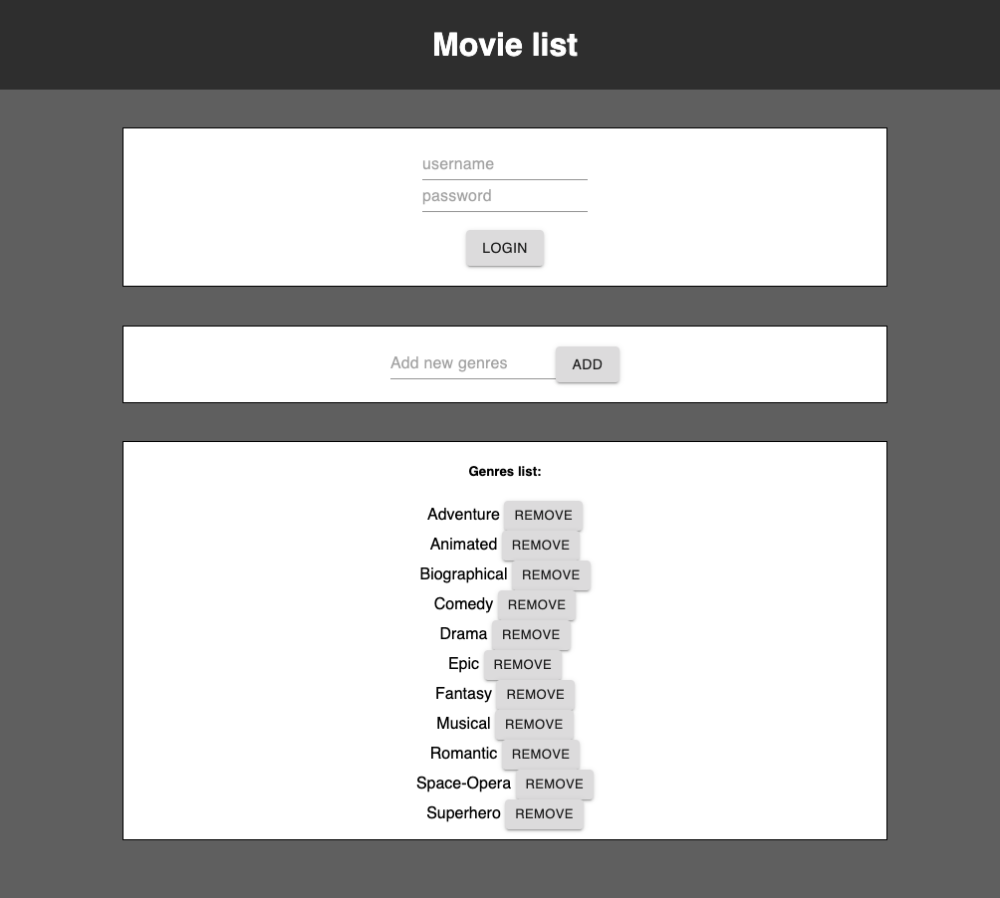
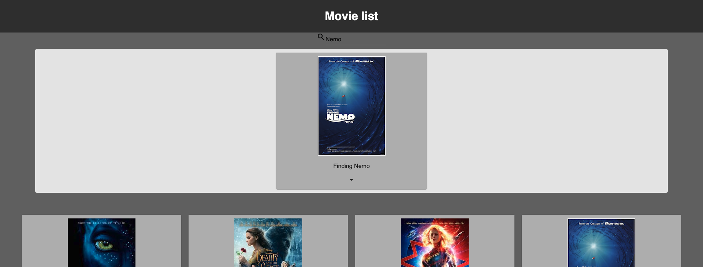

# Movie Sagas

## Description
Duration: 2 days

### Set up database
[x] Connecting data of movies table and genres table together by junction table
    - With Postico, I use JOIN to pull out the relationship data from two tables in the database.
### Display data from the database to DOM via Saga
[x] Display list of the movie from database
    [x] With Saga, I create a GET request in `index.js` by Axios to get movies list and name of genres from database. 
    [x] Using map to loop through the array of movies that got from database to append them to DOM
    [x] Using HashRouter to able to go to its detail place where have its title and description when the user clicks on the specific poster.
[x] Display title and description in Details component.
    [x] Using Saga to get title and description from MovieItem.js component.
[x] Display genres for each movie from database
    [x] Using Saga to get genres from MovieItem.js component.

    
[x] Edit the selected movie's title and description
    [x] Create Edit component
        [x] Create first inputs field for changing the movie title of the selected movie
        [x] Create a second inputs field for changing the movie description.
    [x] Create Cancel button to bring the user to the Details Page
    [x] Create Save button to update the title and description by sending despatch to Index.js, cross through reducer, and in Details component get changes and append to DOM, also bring the user back to Details page.

[x]   Use array_agg to display all genres on the movie list page.

[x] The page admin display a form to add genres to the database.
    [x] Take the input from the client, send that input data to index.js via dispatch. Then use Saga POST request to add new genres to the server. And to end the add new genres, I use the same action type of the one that we got genres data from database before to get the data back and append to the DOM. 
    [x] Using Saga DELETE request to delete the selected genres to server. By axios, use DELETE request to delete that genre in database and then refresh the DOM with the same way of add genres.

## Screen Shot

## Installation

1. Create a database named your database name,
2. The queries in the tables.sql file are set up to create all the necessary tables and populate the needed data to allow the application to run correctly. The project is built on Postgres, so you will need to make sure to have that installed. We recommend using Postico to run those queries as that was used to create the queries,
3. Open up your editor of choice and run an npm install
4. Run npm run server in your terminal
5. Run npm run client in your terminal
6. The npm run client command will open up a new browser tab for you!

## Built With

HTML, CSS, React, JSON, Node.js, Postico(database), Express.js, Material-UI, 

## Acknowledgement

Thanks to Prime Digital Academy who equipped and helped me to make this application a reality.

## Support

If you have suggestions or issues, please email me at If you have suggestions or issues, please email me at thyvu0411@gmail.com